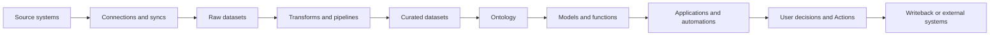
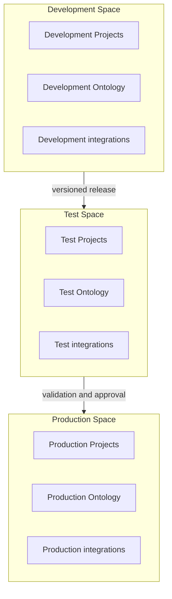
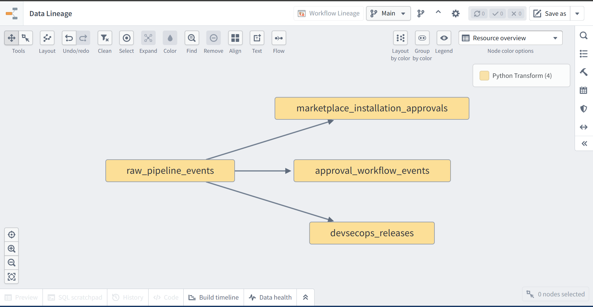
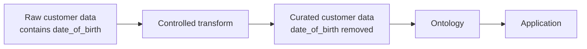
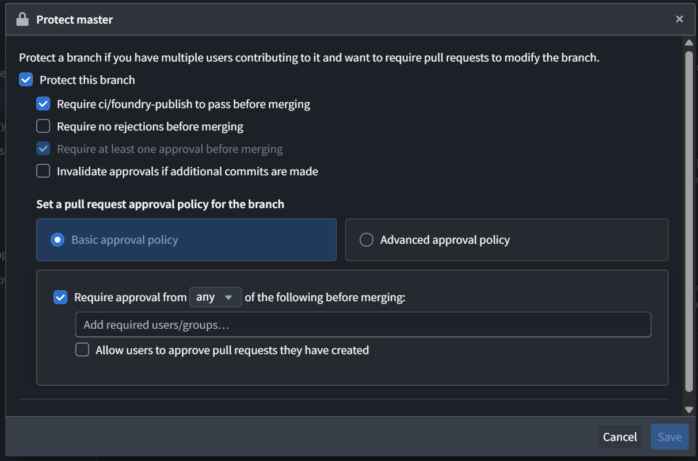
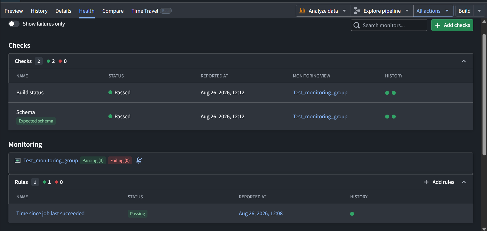
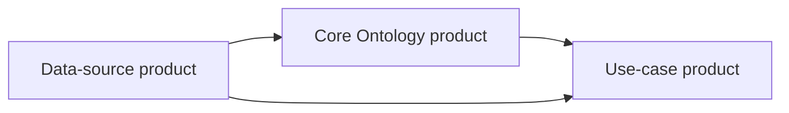
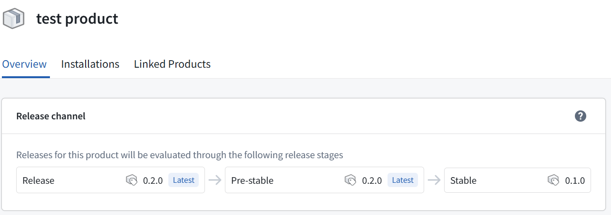
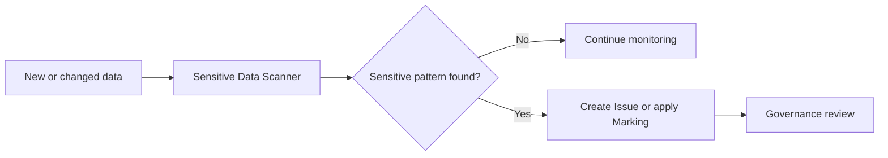

# DevSecOps in Palantir Foundry

> **Scope.** This article presents a practical DevSecOps operating model for solutions built in Palantir Foundry. Capabilities can vary by enrollment configuration, permissions, licensing, deployment architecture, and product lifecycle stage. Foundry can support an organization’s security and compliance controls, but enabling a platform feature does not by itself establish compliance with a regulation or standard.

## Executive summary

DevSecOps integrates development, security, governance, validation, release management, and operational monitoring into a continuous delivery lifecycle. In Palantir Foundry, this lifecycle must protect more than source code because a production solution can include data connections, datasets, pipelines, Ontology resources, models, Functions, applications, Actions, automations, and external integrations.

A practical Foundry DevSecOps architecture begins by establishing clear access and environment boundaries. Organizations and Markings provide mandatory access requirements, while Projects and roles provide discretionary access control. Branches support isolated development, and separate long-lived Development, Test, and Production environments can provide stronger release and operational separation where required.

During development, teams should use protected branches, pull-request reviews, continuous-integration checks, Code Scanning where enabled, dependency management, data-quality validation, and controlled network egress. Security-sensitive data changes require additional care because Markings can propagate through downstream dependencies. Removing a sensitive column does not automatically remove an inherited Marking; declassification must be explicitly reviewed and implemented through the supported security process.

Foundry DevOps supports the delivery portion of this lifecycle by packaging resources into versioned products and managing dependencies, release channels, and installations. It should be treated as a release-management mechanism within the broader DevSecOps operating model—not as a replacement for security governance, testing, production controls, monitoring, or incident response.

After release, teams should monitor pipeline health, application and integration failures, model behavior, and audit activity. Findings from production should feed back into development as improved tests, scanning rules, access controls, policies, and runbooks.

The recommended operating model is:

> **Govern → Develop → Secure → Validate → Release → Operate → Monitor → Improve**

The central principle is that security should not be a final checkpoint before production. It should influence how every Foundry resource is designed, changed, approved, released, and operated.

## How to read this guide

This guide is organized around the lifecycle of a Foundry solution rather than around a single product or application.

- **Executives and use-case owners** can focus on the Executive Summary, why DevSecOps is needed, the shared operating model, the practical example, and the implementation checklist.
- **Platform administrators and governance teams** should focus on Organizations, Spaces, Projects, roles, Markings, environment separation, network controls, and audit monitoring.
- **Developers and data engineers** should focus on branching, protected branches, Code Scanning, dependencies, data validation, schemas, and health checks.
- **Model and AI teams** should review the model-governance and human-oversight sections in addition to the development controls.
- **Release and operations teams** should focus on Foundry DevOps, product dependencies, release channels, production permissions, monitoring, and incident feedback.

The sections follow a change from initial governance and development through validation, release, production operation, and continuous improvement.

## 1. What is DevSecOps in Foundry?

DevSecOps combines development, security, and operations into one continuous delivery lifecycle.

- **Development** creates and changes data pipelines, Ontology resources, models, Functions, applications, and integrations.
- **Security** protects identities, data, code, credentials, external connections, and sensitive business operations.
- **Operations** releases, monitors, supports, and improves production workflows.

In a traditional delivery process, security may be treated as a review performed after development. In DevSecOps, security and governance requirements influence how a solution is designed, developed, tested, released, and monitored.

In Foundry, this approach must apply to more than source code. A production change may alter data, schemas, security propagation, Ontology semantics, model behavior, user permissions, Actions, or external integrations. DevSecOps therefore provides the operating model for controlling the complete data-backed workflow.
## 2. Why Foundry needs lifecycle-wide DevSecOps

### DevSecOps complexity across cloud and hybrid environments

DevSecOps becomes more complex when a solution spans multiple cloud platforms, on-premises systems, software-as-a-service applications, and data environments. Security and delivery controls may be distributed across separate identity systems, CI/CD tools, secret stores, network policies, vulnerability scanners, data catalogs, deployment services, and monitoring platforms. Each environment can also use different permission models, policy formats, release mechanisms, and audit-log schemas.

Teams must connect these controls while maintaining consistent access policies, traceability, environment separation, and operational ownership. A change that appears safe within one service may still affect data or dependencies managed elsewhere, and fragmented tooling can make it difficult to understand the complete impact of a release.

Foundry can bring many controls for data-backed workflows—such as lineage, Projects and roles, Markings, branching, validation, product delivery, and monitoring—into a connected platform experience. This can reduce coordination overhead, but it does not eliminate the organization’s responsibilities for external cloud infrastructure, source systems, identities, credentials, network access, dependencies, containers, or security monitoring.

### Why DevSecOps is different in Foundry

A conventional application is often represented primarily by code, configuration, infrastructure, and a database. A Foundry solution may span the full path from source data to an operational decision:



Every transition introduces a control question:

- Who may connect to the source system?
- Where are credentials stored?
- Which developers may change ingestion or transformation logic?
- What happens when sensitive data enters a pipeline?
- Which downstream resources inherit an access requirement?
- Who may change Ontology semantics or Action behavior?
- How are models evaluated and promoted?
- Which integrations may send data outside Foundry?
- Who may install or upgrade a production product?
- How are failures, quality regressions, and suspicious activity detected?

DevSecOps in Foundry is therefore a combined **software, data, model, application, and operational-governance discipline**.

### DevSecOps versus Foundry DevOps

| Area | DevSecOps operating model | Foundry DevOps |
|---|---|---|
| Scope | End-to-end delivery and operation | Product delivery |
| Governance | Core concern | Supports controlled distribution |
| Access control | Core concern | Relies on platform security architecture |
| Code security | Scanning, review, and dependency management | Not its primary purpose |
| Data protection | Classification, minimization, and propagation | Inputs must be mapped securely |
| Model governance | Evaluation and production acceptance | Can package supported workflow resources |
| Versioning | Required across relevant assets | Product versions |
| Controlled rollout | Policy and approval process | Release channels and installations |
| Environment separation | Architecture and operating policy | Supports installation across environments |
| Monitoring | Health, audit, detection, and response | Installation management is one input |
| Incident response | Core concern | Outside product packaging itself |

Foundry DevOps is therefore the **delivery subsystem** of a broader DevSecOps architecture.

### A shared operating model

Foundry supplies security, governance, development, delivery, and monitoring primitives. The organization using Foundry remains responsible for configuring those primitives according to its policies and operating them effectively.

| Responsibility | Typical accountable party |
|---|---|
| Organization, Space, and role architecture | Platform governance or administration |
| Data classification and Marking policy | Data owner, privacy, or security team |
| Project design and resource ownership | Platform architect and use-case owner |
| Transformation and application logic | Development team |
| Code and dependency maintenance | Repository owner |
| Data-quality rules | Data owner and pipeline owner |
| Model acceptance criteria | Model owner, risk owner, and business owner |
| Release approval | Designated release authority |
| Production installation and upgrades | Operations or release-management team |
| Audit monitoring and incident response | Security and platform operations |

The same person may perform several responsibilities in a small deployment. The essential requirement is that ownership and approval authority are explicit.

## 3. Governance foundations

### Govern before development

DevSecOps begins before the first pipeline or application is created. Teams should determine:

- Where the workflow belongs
- Who owns it
- Who may develop it
- Which data classifications apply
- Which environments are required
- Which external systems may be reached
- Who may approve and release changes
- How production will be monitored and supported

### Organizations and Spaces

Organizations are strict access requirements applied to Projects. They help establish mandatory segregation between users and resources.

Spaces are high-level containers for Projects with a common Ontology and purpose. Spaces were formerly called namespaces. A Space can represent a business domain, collaboration boundary, or long-lived release environment.

For release management, one common architecture uses separate Spaces for Development, Test, and Production:



This is stronger than naming resources `dev_*`, `test_*`, and `prod_*`. Naming improves readability, but does not create a security or release boundary.

### Projects and roles

Projects are the primary security boundary for discretionary access in Foundry. A Project should normally contain resources whose collaborators have approximately uniform access requirements.

Rather than placing an entire solution in one Project, teams may separate resources by purpose and ownership:

```text
Production Space
├── Customer Source Project
├── Customer Transformation Project
├── Risk Model Project
├── Customer Ontology Project
└── Customer Risk Application Project
```

Default roles include Owner, Editor, Viewer, and Discoverer, although an enrollment can customize its role model.

Recommended practices include:

- Grant roles to groups rather than individual users.
- Grant roles at the Project level where practical.
- Keep resource-level grants disabled unless an exception is justified.
- Use separate groups for ownership, development, operation, and consumption.
- Avoid granting Owner merely because a user needs temporary edit access.
- Review group membership and Project roles periodically.

### Mandatory controls: Organizations and Markings

Roles are discretionary controls: an authorized owner can use them to share access. Organizations and Markings are mandatory controls. They can prevent access even when a user has otherwise received a sufficient Project role.

Markings are commonly used for categories such as:

- Personally identifiable information
- Protected health information
- Export-controlled information
- Investigation data
- Commercially restricted data
- Data requiring specific training or acknowledgment

A user must satisfy every applicable Marking in addition to holding the required role. Markings should restrict eligibility for sensitive data; they should not replace Project roles as the normal mechanism for provisioning access.

### Understand security propagation before changing data access

Markings can propagate through the filesystem hierarchy and direct data dependencies. Changing an upstream dataset’s Markings can therefore affect downstream resources and users immediately.

Before applying or removing a Marking:

1. Identify the data owner and approval authority.
2. Open the pipeline in Data Lineage.
3. Simulate the proposed Marking change.
4. Review every affected downstream resource.
5. Identify users and workflows that may lose access.
6. Confirm whether the sensitive data is required downstream.
7. Apply the change through the approved security process.
8. Revalidate downstream data and application behavior.



*Figure 1. Data Lineage exposes downstream dependencies that should be reviewed before security, schema, or release changes are introduced.*

#### Declassifying transformed data safely

Consider a raw dataset containing `date_of_birth`:



Dropping `date_of_birth` may be necessary if downstream users do not need it, but it is **not sufficient by itself** to remove an inherited Marking.

The team must also:

- Verify that no sensitive representation remains.
- Modify the transform to stop propagation or remove the inherited Marking through the supported security mechanism.
- Use a protected branch.
- Obtain the required security approval.
- Build and inspect the resulting data.
- Repeat the lineage simulation before applying the upstream Marking.
- Retain evidence of the review.

Removing an inherited Marking is a declassification decision, not merely a data-cleaning operation.

### Separate short-lived development from long-lived environments

Foundry supports complementary isolation patterns:

| Pattern | Best suited for | Primary purpose |
|---|---|---|
| Repository or Global Branching | Short-lived feature development and review | Isolate supported changes before merging them into an environment |
| Separate Spaces with DevOps and Marketplace | Long-lived Development, Test, and Production environments | Promote versioned products across operational boundaries |

Branches enable rapid iteration and can isolate supported resources from `main`. They do not automatically replace long-lived Test and Production environments that require different data, integrations, policies, or operational ownership.

A mature architecture may use both:

```text
Feature or global branch
    ↓
Development main
    ↓
Development product version
    ↓
Test installation
    ↓
Validation and approval
    ↓
Production installation
```

#### Environment-specific configuration

Each environment can require different:

- Input datasets
- Source-system connections
- Credentials
- Notification recipients
- Approval groups
- Model endpoints
- Markings and access policies
- External API destinations
- Operational schedules
- Scale and compute configuration

A Test installation should normally use Test resources rather than silently reading Production dependencies. Product inputs should be mapped deliberately, and upstream products should be installed before downstream dependents.

## 4. Secure development and validation

Secure development in Foundry combines controlled code changes with validation of data, security propagation, models, applications, and external integrations.

### Use protected branches

For repositories that produce production assets, protect the production branch. Depending on the repository and organizational policy, protections can require:

- Changes to arrive through a pull request
- Successful `ci/foundry-publish`
- At least one approval
- No outstanding rejection
- Approval from a specific user or group
- File-sensitive advanced approval policies
- Security approval for changes affecting Marking propagation
- Stable Function versions to originate from protected branches



*Figure 2. Protected branches can require successful CI and pull-request approval before changes are merged. The image illustrates available controls and does not represent a particular organization's saved policy.*

A review policy can map reviewers to the nature of the change:

| Change | Appropriate reviewer |
|---|---|
| Transformation logic | Repository maintainer |
| Output schema | Data-product owner |
| Marking propagation | Security or data-governance authority |
| Model logic or threshold | Model and business-risk owner |
| Action or writeback behavior | Operational-process owner |
| External API or egress logic | Security or integration owner |
| Production configuration | Release authority |

### Use Code Scanning, but understand its scope

Foundry Code Scanning is static analysis integrated with Jemma. An enrollment administrator enables it from **Control Panel → All Settings → Security & Governance → Code scanning**, either enrollment-wide or through Project and repository overrides. When enabled for a repository, commits are analyzed using configured rules and findings appear automatically in Checks; individual developers do not need to start a separate scan manually.

Administrators can:

- Enable scanning enrollment-wide
- Override scanning for selected Projects or repositories
- Enable or disable built-in rules
- Add custom rules
- Configure Error or Warn behavior

Custom rules use Semgrep-compatible rule syntax, allowing an organization to encode internal standards as repeatable checks.

Code Scanning should not be described as the entire software-security program. Static analysis is distinct from:

- Dependency and package-version management
- Credential and secret management
- Container-image governance
- Network egress control
- Dynamic testing
- Business-logic review
- Data-governance validation
- Runtime monitoring

### Maintain dependencies and runtimes

User-authored code can depend on packages with known vulnerabilities. Repository owners remain responsible for tracking and updating those dependencies.

Teams should:

- Maintain an inventory of direct and important transitive dependencies.
- Apply generated repository upgrades promptly.
- Run builds and regression tests before merging upgrades.
- Avoid unsupported package versions.
- Document exceptions and compensating controls.
- Reassess dependencies after relevant security bulletins.
- Treat externally supplied libraries and containers as supply-chain inputs.

Where user-uploaded containers are permitted, use available container-governance controls and define who may approve, operate, or recall affected containers.

### Keep credentials out of code

Credentials should not be placed in:

- Repository source files
- Markdown documentation
- Dataset contents
- Application parameters visible to users
- Screenshots
- Build logs
- Product descriptions or identifiers

Use Data Connection and supported external-function or external-transform mechanisms to manage external-system authentication.

### Control network egress

A workload allowed to connect to an external system may move data in either direction. Egress is therefore both an integration concern and a data-protection concern.

Apply these principles:

- Permit only required destinations and ports.
- Prefer narrow policies over wildcard destinations.
- Restrict which workloads and developers may use a policy.
- Separate non-production and production destinations.
- Review code that invokes external systems.
- Monitor exports and external calls.
- Revoke policies that are no longer required.
- Require approval for new production egress paths.

### Validate more than whether the code builds

A successful build proves that code executed. It does not prove that the output is correct, safe, or ready for production.

| Validation dimension | Example controls |
|---|---|
| Code correctness | Unit tests, type checks, CI, peer review |
| Data contract | Schema, nullability, key uniqueness, allowed values |
| Data quality | Reconciliation, completeness, accuracy, distribution checks |
| Security | Marking simulation, permission review, egress review |
| Privacy | Data minimization, de-identification review, retention requirements |
| Ontology | Property mapping, link cardinality, Action behavior |
| Models | Metrics, subset evaluation, thresholds, robustness tests |
| Applications | Role-based testing, error states, Action confirmation |
| Integrations | Test endpoints, retries, authentication, failure handling |
| Operations | Schedules, freshness, duration, alert routing, runbooks |

#### Use production-scale evidence

Do not rely exclusively on sampled previews for release validation. Sampling can miss rare values, skewed joins, duplicate keys, or large-scale performance behavior. Build affected datasets on the relevant branch or environment and validate the materialized results.

#### Treat schemas as contracts

Changing a dataset schema can break downstream pipelines, Ontology mappings, applications, exports, and external consumers.

For a breaking change:

1. Identify consumers through lineage.
2. Prefer additive changes where practical.
3. Announce deprecations.
4. Allow consumers time to migrate.
5. Remove deprecated fields through a controlled major change.
6. Verify that product inputs and Ontology mappings still resolve.

#### Monitor data health

Health checks can validate:

- Schedule or job success
- Build duration
- Dataset freshness
- Time since last update
- Schema stability
- Sync status and freshness

Health checks provide operational signals. They do not replace domain-specific validation of whether a value is accurate or appropriate.



*Figure 3. Health checks provide operational signals for build success, schema stability, freshness, and other reliability conditions.*

### Govern models and AI components

When a solution contains a machine-learning model, releasing transformation code is only part of the control process.

The model lifecycle should identify:

- Model version
- Training and evaluation data
- Evaluation metrics
- Performance on meaningful subsets
- Acceptance thresholds
- Reviewer and approver
- Intended environment
- Deployment configuration
- Monitoring and recovery criteria
- Business owner
- Human oversight requirements

Modeling Objectives can support model submission, evaluation, review, release, and deployment. Model submissions are immutable copies, while releases are versioned production-ready assets. Deployments can consume tagged releases for batch or live inference.

For LLM-backed Functions or Logic, also define:

- Evaluation cases
- Prohibited or unsafe outcomes
- Grounding and retrieval requirements
- Tool and Action permissions
- Human-approval points
- Logging and feedback mechanisms
- Behavior when a model or external service is unavailable

The presence of a model does not remove responsibility from the human or operational process consuming its output.

## 5. Release and production operations

### Package and release with Foundry DevOps

Foundry DevOps supports the delivery portion of the lifecycle through:

- Product packaging
- Product versions
- Dependency management
- Release channels
- Installations
- Installation upgrades
- Environment views
- Maintenance windows

A common product architecture is:



Where practical, packaging a Project as a product creates a legible relationship between ownership, permissions, and release artifacts. Complex workflows may use linked products, with upstream products satisfying downstream inputs.

#### Release channels

Product versions can be tagged with:

- **Release**
- **Pre-Stable**
- **Stable**

Installations track one channel. The channels are hierarchical:

- An installation tracking **Release** can receive Release, Pre-Stable, or Stable versions.
- An installation tracking **Pre-Stable** can receive Pre-Stable or Stable versions.
- An installation tracking **Stable** receives Stable versions.

Organizations should document how those channels map to internal release policy rather than assuming the channel name itself constitutes approval.



*Figure 4. Release channels determine which product versions qualify for installations tracking each channel.*

#### Release gates

A production release record should answer:

- What changed?
- Which resources are included?
- Which inputs are expected?
- Which tests ran?
- Which findings remain open?
- Who reviewed the change?
- Who approved production release?
- Which version was installed?
- When was it installed?
- How will it be monitored?
- What is the recovery plan?

Release channels automate distribution eligibility. They do not replace organizational approval, testing, or evidence requirements.

### Enforce production separation and least privilege

Production should not operate like a general development workspace.

Recommended controls include:

- Restricting Editor and Owner roles
- Separating development and release groups
- Requiring reviewed products rather than direct manual modification
- Protecting production integrations and credentials
- Restricting egress-policy use
- Limiting who may install, upgrade, unlock, or reconfigure products
- Monitoring emergency changes
- Defining break-glass access and retrospective review
- Performing periodic access recertification

A separation-of-duties model may look like:

```text
Developer
    creates and tests change
        ↓
Technical reviewer
    reviews implementation
        ↓
Data, security, or model reviewer
    reviews domain-specific impact
        ↓
Release authority
    approves promotion
        ↓
Production operator
    installs or upgrades the approved version
```

Not every organization requires a different person for every step. The workflow should reflect the organization’s risk, regulation, and staffing model.

### Monitor production and retain evidence

#### Pipeline and application operations

Operational monitoring should cover:

- Failed or delayed syncs
- Failed schedules and builds
- Stale data
- Schema drift
- Model deployment failures
- Function or Action errors
- Integration failures
- Unexpected runtime or compute changes
- Product-installation health
- User-reported defects

Each production workflow should have:

- A named owner
- A support channel
- Alert recipients
- A runbook
- A service expectation
- An escalation path
- A recovery procedure

#### Audit monitoring

Foundry audit logs support investigation of:

- Who performed an action
- What action occurred
- When it occurred
- Where it occurred
- Which users or resources were involved

For new implementations, use the `audit.3` schema. Organizations with an established security-operations function should generally ingest logs into their SIEM. Audit logs can alternatively be exported to a protected Foundry dataset for in-platform analysis.

Audit data can itself contain sensitive information, including identity and usage information. Apply appropriate access requirements to an exported audit dataset.

Useful monitoring categories include:

- Authentication activity
- Data loads
- Data exports
- Permission changes
- Token generation
- Data creation and deletion

Monitoring should establish normal baselines before generating high-severity anomaly alerts.

### Detect sensitive data continuously

Sensitive Data Scanner can supplement, but not replace, data-owner classification.

Governance teams can configure:

- Organization-specific definitions
- Included datasets, Projects, or Spaces
- One-time or recurring scans
- Exclusions
- Alerting behavior
- Automatic application of a Marking



Automatic Marking can disrupt downstream access if configured too broadly. Test definitions on a controlled scope before expanding them.

### Close the feedback loop

A mature process converts production findings into durable improvements:

```text
Production signal
    ↓
Triage and investigation
    ↓
Root-cause analysis
    ↓
Remediation
    ↓
New test, rule, policy, or runbook
    ↓
Reviewed release
    ↓
Production verification
```

Examples include:

- A recurring coding defect becomes a custom Code Scanning rule.
- A schema incident becomes an input schema check.
- An unauthorized egress attempt results in a narrower egress policy.
- A stale dataset incident results in a freshness check and escalation route.
- An over-broad role grant results in group and Project redesign.
- A sensitive-data discovery results in a new scanner definition.
- A model failure results in a new subset metric or acceptance threshold.

## 6. Practical example: Customer-risk workflow

Consider a customer-risk application containing:

```text
Customer source
    ↓
Ingestion and cleaning
    ↓
Risk features
    ↓
Risk model
    ↓
Ontology
    ↓
Workshop application
    ↓
Operational decision
```

A secure delivery process would:

1. Establish Development, Test, and Production environments.
2. Define Project ownership and group-based roles.
3. Classify sensitive customer data.
4. Store source credentials through Data Connection.
5. Restrict network egress to approved destinations.
6. Develop changes on a branch.
7. Run CI and Code Scanning.
8. Build and inspect affected outputs.
9. Simulate Marking propagation.
10. Obtain approval for any declassification.
11. Validate schema, quality, Ontology, model, and application behavior.
12. Package approved resources into products.
13. Install upstream products before dependent products.
14. Map Test inputs to Test resources.
15. Release a validated version through the chosen channel.
16. Install or upgrade Production through the designated authority.
17. Monitor pipeline health, application behavior, and audit logs.
18. Feed incidents and findings back into development controls.


## 7. Best practices at a glance

A practical Foundry DevSecOps implementation should follow these principles:

1. **Establish boundaries before development.** Define Spaces, Projects, ownership, roles, Organizations, and Markings before building production workflows.
2. **Apply least privilege.** Grant access primarily through groups and limit production Owner and Editor permissions.
3. **Treat data security as part of development.** Use lineage and simulation to understand how sensitive-data controls affect downstream resources.
4. **Separate development from production.** Use branches for short-lived development and deliberate environment separation for long-lived Test and Production workflows.
5. **Protect production changes.** Require pull requests, successful CI, appropriate reviewers, and security approval for sensitive changes.
6. **Validate outputs, not only code.** Test schemas, data quality, Ontology behavior, model behavior, applications, integrations, and operational readiness.
7. **Manage the complete software supply chain.** Maintain dependencies, repository runtimes, credentials, containers, and network egress controls.
8. **Keep environment dependencies aligned.** Test installations should normally use Test inputs, while Production installations should use Production inputs.
9. **Use release management deliberately.** Treat product versions and release channels as delivery mechanisms, not substitutes for organizational approval.
10. **Monitor continuously.** Combine health checks, audit monitoring, support ownership, and incident-response procedures.
11. **Convert incidents into preventive controls.** Use operational findings to improve tests, scanning rules, access controls, policies, and runbooks.

## 8. Best-practice implementation checklist

### Governance

- [ ] Every production workflow has an accountable owner.
- [ ] Organization and Space boundaries are documented.
- [ ] Projects reflect meaningful access boundaries.
- [ ] Roles are granted primarily through groups.
- [ ] Sensitive-data classifications and Marking owners are defined.
- [ ] External integrations and egress routes have owners.
- [ ] Retention and deletion requirements are documented.

### Development

- [ ] Production branches are protected.
- [ ] CI success is required.
- [ ] Code review is required.
- [ ] Security-sensitive files have designated reviewers.
- [ ] Code Scanning is enabled where appropriate.
- [ ] Dependencies and repository upgrades are maintained.
- [ ] Credentials are not stored in code.
- [ ] Relevant changes are built on a branch using appropriate data.

### Validation

- [ ] Output schemas are reviewed as contracts.
- [ ] Domain-specific data-quality rules exist.
- [ ] Marking changes are simulated in lineage.
- [ ] Declassification requires explicit approval.
- [ ] Ontology and Action behavior is tested.
- [ ] Applications are tested with representative roles.
- [ ] Models meet documented acceptance criteria.
- [ ] External integrations are tested against non-production endpoints.

### Release

- [ ] Products and dependencies have clear ownership.
- [ ] The product version has release notes.
- [ ] Required evidence and approvals are recorded.
- [ ] Test inputs resolve to Test resources.
- [ ] Production inputs resolve to Production resources.
- [ ] Upstream products are installed first.
- [ ] Release-channel policy is documented.
- [ ] Recovery procedures exist.

### Operations

- [ ] Schedules and required health checks are configured.
- [ ] Alert recipients and escalation paths are current.
- [ ] Production access is minimized.
- [ ] Audit logs are monitored.
- [ ] Audit datasets are protected as sensitive.
- [ ] Incident runbooks are tested.
- [ ] Access and egress policies are reviewed periodically.
- [ ] Findings are converted into preventive controls.

## Conclusion

DevSecOps in Palantir Foundry is not a final security review and not a single product. It is an operating model connecting:

- Identity and access
- Data classification and propagation
- Secure software development
- Pipeline and model validation
- Product packaging and environment promotion
- Production monitoring
- Audit and incident response
- Continuous improvement

Foundry supplies primitives for implementing this model: Organizations, Spaces, Projects, roles, Markings, lineage, protected branches, Code Scanning, health checks, model governance, DevOps products, release channels, installations, Sensitive Data Scanner, network controls, and audit logs.

The organization must combine those primitives into an explicit lifecycle with named owners, review gates, evidence, and operational accountability.

The target state is:

> **Govern → Develop → Secure → Validate → Release → Operate → Monitor → Improve**

When these stages are designed together, security becomes part of how Foundry solutions are built and operated—not a checkpoint performed immediately before production.


## Authors

- [Aakash Sharma](https://github.com/aakash0987)
- [Abhishek Narayan Chaudhary](https://github.com/achaudhury7378)
- [Yogesh Raja](https://github.com/yogesh01712)

---

# [Back to Rocket Ship front page](https://shauryashaurya.github.io/rocket-ship/)
