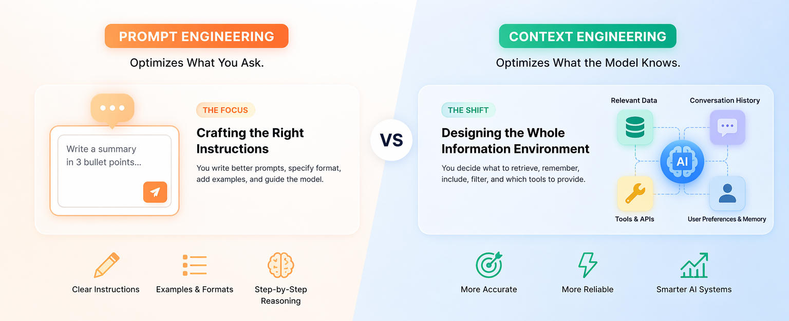
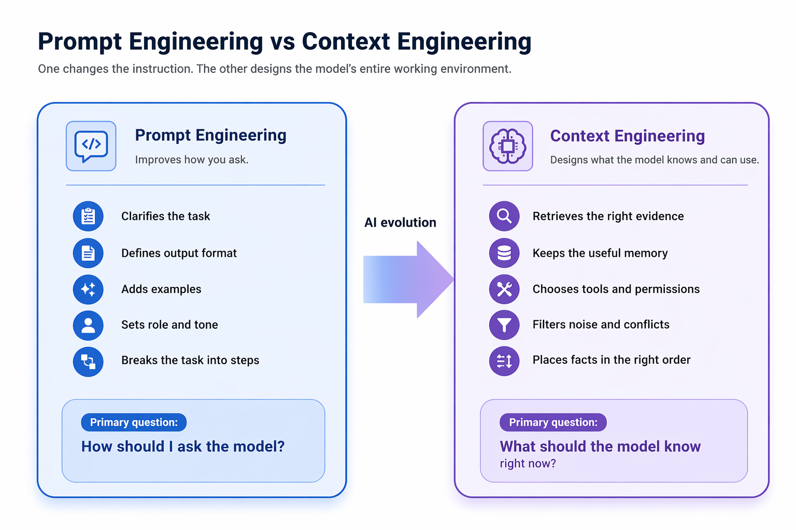
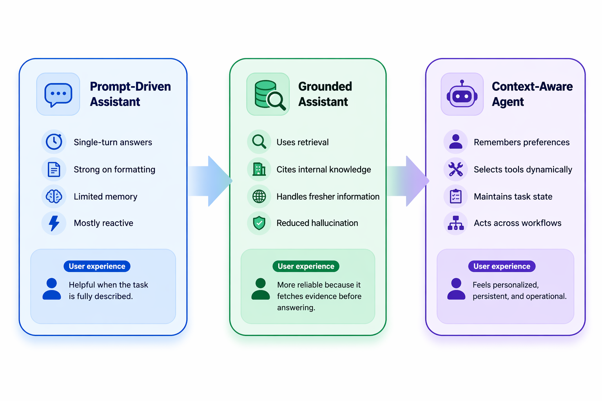

# From Prompt Engineering to Context Engineering: How AI Systems Are Evolving
Why the next leap in AI is coming not from smarter prompts alone, but from better memory, retrieval, and state-aware orchestration.

## TL;DR
Prompt engineering made AI impressive by improving how we ask. Context engineering is what will make AI dependable, personalized, and truly agentic, because the future of AI depends not only on better instructions, but on better memory, retrieval, tools, and context-aware orchestration around the model.

## Introduction 
AI is evolving because the unit of optimization is shifting from the prompt alone to the entire working context around the model.  
For the first wave of large language model adoption, **prompt engineering** stood at the center of industry attention. That focus was understandable. Early breakthroughs revealed that the behavior of a model could change significantly depending on how a task was framed. GPT-3 demonstrated the power of few-shot learning, showing that carefully placed examples inside a prompt could unlock capabilities that were not obvious at first glance. Subsequent techniques such as Chain-of-Thought prompting showed that encouraging intermediate reasoning could improve performance on more complex problems, while self-consistency extended this idea by exploring multiple reasoning paths before arriving at an answer. 

This phase of progress established an important principle: **the way a model is instructed matters**. It shaped the early imagination around generative AI and made prompt design appear to be the primary lever for improving model performance. Over time, however, that view began to reveal its limits. As AI systems moved from controlled demonstrations to real-world applications, it became increasingly clear that high-quality instructions alone could not guarantee high-quality outcomes.

A language model can respond only through the information available to it at the moment of inference. If the most relevant facts are missing, outdated, poorly retrieved, or buried within an overloaded context window, even the most carefully designed prompt will fall short. This realization has led to a broader shift in how AI systems are being built and evaluated. The conversation is no longer centered only on **how to ask better**, but also on **how to ensure the model has the right context when it answers**. That is the foundation of the transition from prompt engineering to context engineering. 

### What Prompt Engineering Solved and Where It Hit a Wall

**Prompt engineering** remains valuable because it improves performance at the instruction layer. It helps define the task clearly, shape the output, provide examples, and guide the model toward a desired style of reasoning. For bounded use cases such as summarization, extraction, classification, formatting, or isolated coding support, this is often enough. In such settings, the prompt can carry most of the information needed for a strong response. 

Its limitations become visible when AI moves into **more complex, real-world workflows**. Enterprise assistants must work with **private documents**, research copilots need **current information**, and long-running agents must remember preferences, use tools, and track progress across steps. In these cases, the challenge is no longer only about asking well. It becomes a question of **what the model knows, what it can access, and what it can retain while solving the task**. 

That is where prompt engineering begins to reach its limit. The problem shifts from refining instructions to designing the model’s **working environment the context, memory, retrieval, and tools** that shape how effectively it can operate.

### Why Context Engineering Is Becoming the New Center of Gravity

**Context engineering** is the discipline of designing the full information state around the prompt. It includes **retrieval, memory, conversation history, tool access, permissions, ranking, compression, and timing** in other words, everything that determines what the model sees when it reasons. Put simply, **prompt engineering optimizes the instruction; context engineering optimizes the situation**.

This is why the rise of **RAG, long-context models, memory systems, tool-calling, and agents** all points in the same direction. These may appear to be separate innovations, but they address one shared challenge: models perform best when they receive the **right information, in the right form, at the right moment**. As recent work on long context has shown, simply adding more tokens is not enough. Context quality depends on **selection, placement, and relevance**, not just scale.

Once this becomes clear, AI no longer looks like a pure prompting problem. It begins to look like a **systems design problem**. The most capable applications are now defined less by clever wording and more by how effectively they **retrieve evidence, preserve useful memory, expose tools, and maintain state** across steps and sessions.

### How AI Evolves Because of This Shift

This transition is reshaping AI in a visible and practical way. First, systems become more **grounded**. Rather than relying only on static model knowledge, they can retrieve current or domain-specific evidence before generating a response. This improves reliability and makes AI more useful in settings where freshness and factual alignment matter. 

Systems become more **persistent**. A prompt-driven assistant may appear capable, but it often begins each interaction with limited continuity. A context-engineered system can retain preferences, prior decisions, unfinished tasks, and the broader structure of an ongoing workflow. As a result, the experience feels less like restarting from zero and more like collaborating with an informed system that carries forward relevant state. 

Systems become more **operational**. The move toward agents is not simply a change in interface; it is a shift toward context-aware action. An agent does more than generate replies. It selects tools, checks intermediate outputs, uses memory, updates its state, and identifies what information is needed next. In this sense, context engineering is what enables AI to move from answering questions to handling work. 

Finally, the source of competitive advantage changes. In the prompt era, differentiation often came from finding the best phrasing or reasoning pattern. In the context era, it comes from building better retrieval pipelines, memory policies, context ranking, tool interfaces, and orchestration logic. The real moat no longer sits inside the prompt alone it extends into the surrounding system that informs and supports the model.

# [Back to Rocket Ship front page](https://shauryashaurya.github.io/rocket-ship/)        
