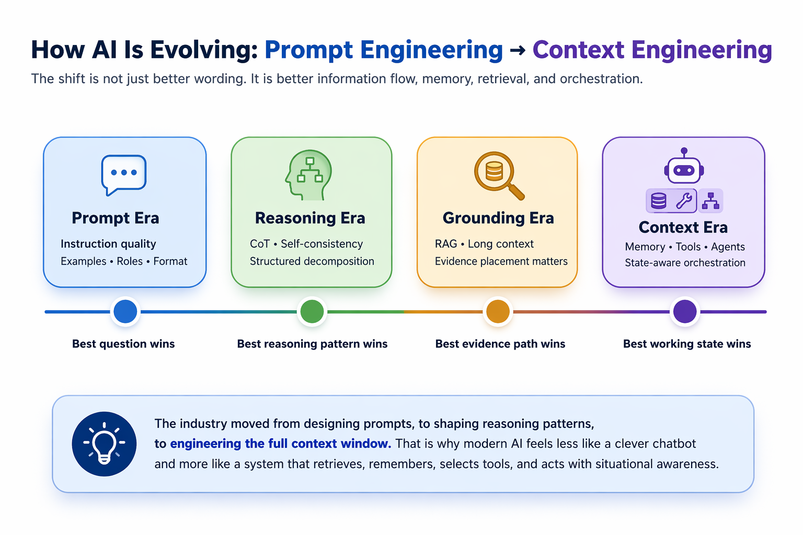

# From Prompt Engineering to Context Engineering: How AI Systems Are Evolving
#### Why the next leap in AI is coming not from smarter prompts alone, but from better memory, retrieval, and state-aware orchestration.

## TL;DR
Prompt engineering made AI impressive by improving how we ask. Context engineering is what will make AI dependable, personalized, and truly agentic, because the future of AI depends not only on better instructions, but on better memory, retrieval, tools, and context-aware orchestration around the model.

## Introduction 
AI is evolving because the unit of optimization is shifting from the prompt alone to the entire working context around the model.  
For the first wave of large language model adoption, **prompt engineering** stood at the center of industry attention. That focus was understandable. Early breakthroughs revealed that the behavior of a model could change significantly depending on how a task was framed. GPT-3 demonstrated the power of few-shot learning, showing that carefully placed examples inside a prompt could unlock capabilities that were not obvious at first glance. Subsequent techniques such as Chain-of-Thought prompting showed that encouraging intermediate reasoning could improve performance on more complex problems, while self-consistency extended this idea by exploring multiple reasoning paths before arriving at an answer. 

This phase of progress established an important principle: **the way a model is instructed matters**. It shaped the early imagination around generative AI and made prompt design appear to be the primary lever for improving model performance. Over time, however, that view began to reveal its limits. As AI systems moved from controlled demonstrations to real-world applications, it became increasingly clear that high-quality instructions alone could not guarantee high-quality outcomes.

A language model can respond only through the information available to it at the moment of inference. If the most relevant facts are missing, outdated, poorly retrieved, or buried within an overloaded context window, even the most carefully designed prompt will fall short. This realization has led to a broader shift in how AI systems are being built and evaluated. The conversation is no longer centered only on **how to ask better**, but also on **how to ensure the model has the right context when it answers**. That is the foundation of the transition from prompt engineering to context engineering. 

